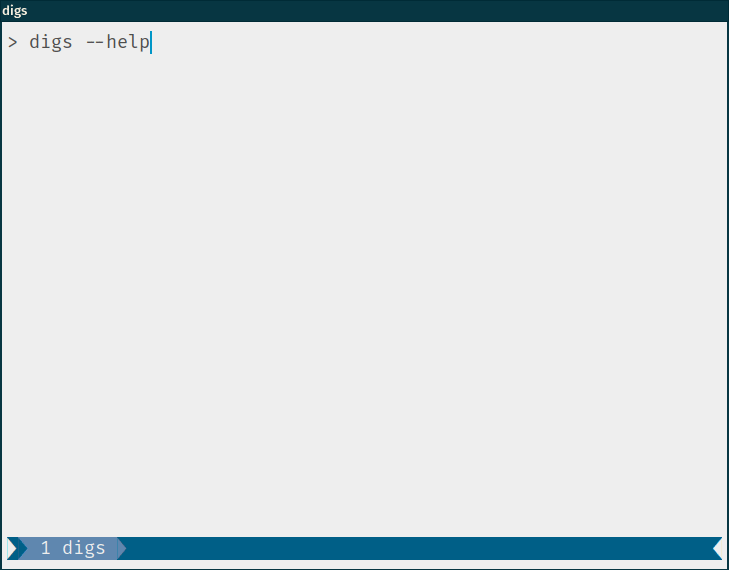

<div align="center">
<h1>digs</h1>

dig many at once.

<a href="https://github.com/BiznetGIO/digs/actions/workflows/ci.yml">

</a>
<a href="https://crates.io/crates/digs">

</a>

<p></p>



</div>

---

_digs_ is a DNS command-line client that able to query many DNS servers at once.

## Why?

We work with DNS records a lot. Having a tools that inspect multiple
records across different machines at once is a lifesaver.

## Features

- Prevent invalid input before querying. Such invalid records type or configuration.
- No panics, good error handling.
- [more faster](docs/benchmark.md) compared to previous `digs.py`.
- Colourful output.
- Cross-platform.
- Single binary.

## Usage

Prepare a configuration file that should look like this:

```toml
[[servers]]
ip = "8.8.8.8"
name = "Google"

[[servers]]
ip = "9.9.9.9"
name = "Quad9"
```

The server can be as many as you want.

Example commands:

```
digs example.net A                    Query a domain using the configuration in current directory
digs example.net A -f custom.toml     ...using custom configuration
```

Run `digs --help` to see more available options.

## Installation

### From binaries

The [release page](https://github.com/BiznetGIO/digs/releases) includes
pre-compiled binaries for GNU/Linux, macOS and Windows.

### From source

Using Rust's package manager [cargo](https://github.com/rust-lang/cargo):

```bash
cargo install digs
```

## Development

```bash
git clone https://github.com/BiznetGIO/digs
cd digs

# Run unit tests and integration tests
cargo test

# Install
cargo install --path .
```

---

## Licence

digs source code is licensed under the [GPLv3](https://choosealicense.com/licenses/gpl-3.0/).
